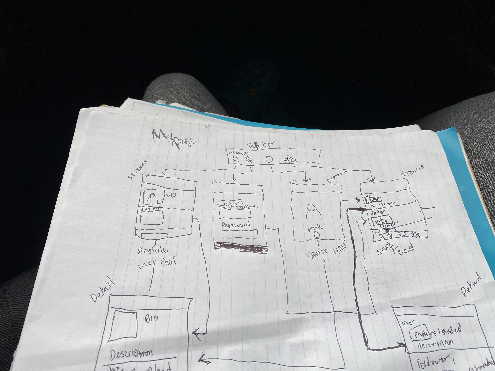
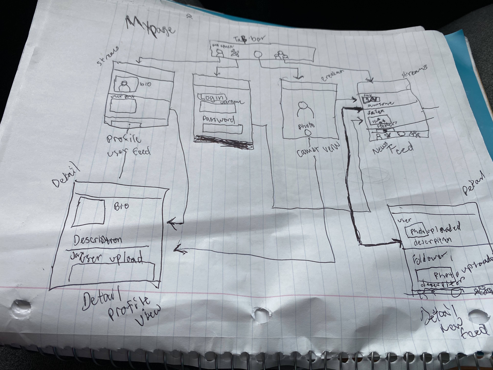

Original App Design Project - README Template
===

# MyPage

## Table of Contents
1. [Overview](#Overview)
1. [Product Spec](#Product-Spec)
1. [Wireframes](#Wireframes)
2. [Schema](#Schema)

## Overview
### Description
[This App is going to be a spin-off of MySpace anf Facebook together!]

### App Evaluation
[Evaluation of your app across the following attributes]
- **Category:**
- **Mobile:**
- **Story:**
- **Market:**
- **Habit:**
- **Scope:**

## Product Spec

### 1. User Stories (Required and Optional)

MyPage will grown into a complex App where users can create profiles, including photographs, blog s, music or movie preferences. Other features of the site include chat room s, forums, classified ads, newsgroup s and a venue for sharing videos or music.
Each user can choose to invite friends to create profiles or link to existing ones, creating a social network that can be exponentially expanded as users with similar tastes, interests or shared friends are discovered and added.

### 2. Screen Archetypes

* Login / Register - User signs up or logs into their account
* Creation - User can create a new Page
* Profile - User can view their identity and stats
* Settings - User can configure app options

### 3. Navigation

**Tab Navigation** (Tab to Screen)

* [Home]
* [Search Bar]
* [Notifications]

**Flow Navigation** (Screen to Screen)

* [Home]
   * [Where User information and Page store]
   * ...
* [Search Bar]
   * [Where you can search different people and add them]
   * ...

## Wireframes

## Schema 
### Models
[Property	Type	Description
objectId	String	unique id for the user post (default field)
author	Pointer to User	image author
image	File	image that user posts
caption	String	image caption by author
commentsCount	Number	number of comments that has been posted to an image
likesCount	Number	number of likes for the post
createdAt	DateTime	date when post is created (default field)
updatedAt	DateTime	date when post is last updated (default field)
SearchBar String to add difeernt user]
### Networking
Home Screen -Read/Get User/Users Posts, Search Users, And Make/Delete Posts
Create Post - Where you can create
Profile Screen -(Read/GET) Query logged in user object ,(Update/PUT) Update user profile image
Search Screen - Where User can see different Users 

